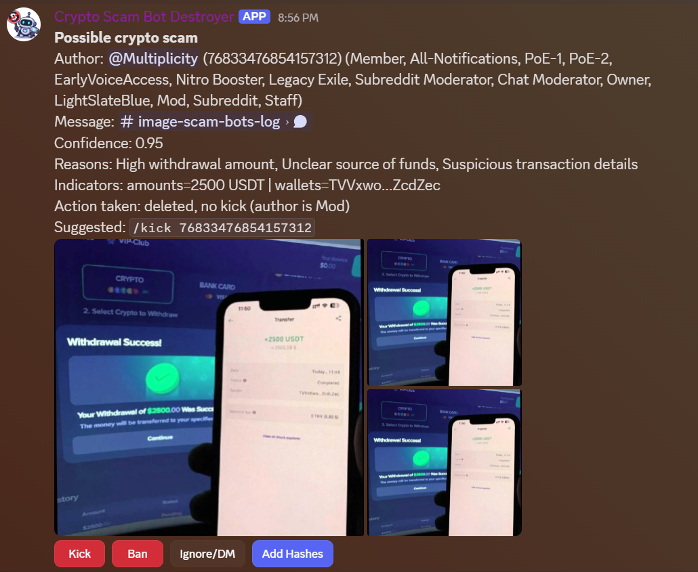

# Discord Crypto Scam Bot Destroyer

This bot helps mods deal with the “3-4 pictures of twitter or a crypto exchange” crypto scam spam. It checks known bad image hashes first, then (optionally) asks OpenAI to classify new patterns. It’s very fast when dealing with known images, and should just cost cents per day if you use the OpenAI API, for a large server. 

## What is this for?

These scams are repetitive, but hard to catch with the native Discord Automoderator, now that they stopped sending links to images, but rather direct uploads. Hashes catch the repeats quickly. The OpenAI vision step catches any new variants and makes this very hands-off, but you can turn it off if you want a hash‑only setup and don't mind some handholding. 

## What it does

- Watches channels in your server
- Checks every message with at least one image against the hash denylist. 
- Deletes scams and optionally kicks, bans, softbans (ban+unban), or just reports to a configured mod channel
- Only calls OpenAI if the message has N or more images (default 3) to keep costs down.
- Optional OpenAI vision classification for unknown images.
  - Cost note: with `gpt-4o-mini`, our 512x512-ish scam images are a tiny fraction of a cent each. Switch to gpt-4.1-mini to cut costs by 50%
- `/add_hash` slash command lets mods upload an image to add its hash.

## Screenshots

Known-bad hash match (auto delete + report):


OpenAI vision detection (model-flagged scam):



## Quick start (Linux, macOS, WSL)

1) Clone the repo:

```bash
git clone <your-repo-url>
cd discord-crypto-spam-destroyer
```

2) Create `.env`:

(See `Where to get keys` below if you are not sure where to find these.)

```bash
DISCORD_TOKEN=...
OPENAI_API_KEY=...
MOD_CHANNEL=...
MOD_ROLE_ID=...
```

2.5) Optional: make sure your APIs are working before you run the full bot:

```bash
make test-discord # Sends a preview of the report UI to your mod channel
make test-openai # Asks OpenAI if the images stored under known_bad_scam_images are scams and reports back to you
```

3) Run:

```bash
make run-bot
```

Having trouble? Consider setting DEBUG_LOGS=true to print verbose logs for each message being processed
For Docker setup, see below

## Where to get keys

Discord bot token:
- https://discord.com/developers/applications
- Create an application -> Bot -> Reset Token
- Enable **Message Content Intent** in the Bot settings

OpenAI API key (optional if using hash-only mode):
- https://platform.openai.com/api-keys
- Create a key and paste it into `.env`
- If you are using restricted keys, enable `chat.completions` request access and make sure the key can call `gpt-4o-mini`

Do not forget to copy your mod channel ID and mod role ID (right-click the channel or role -> Copy ID).

If you want hash-only mode, omit `OPENAI_API_KEY` and set `HASH_ONLY_MODE=true`.

## Install and invite the bot

1) In the Discord Developer Portal, enable **Message Content Intent**.
2) Invite the bot with these permissions:
   - Read Messages
   - Manage Messages
   - Kick Members / Ban Members (only if you want auto-actions)

## Environment variables

Required:

- `DISCORD_TOKEN` - bot token from Discord.
- `MOD_CHANNEL` - channel id or name for reports.
- `MOD_ROLE_ID` - restrict mod actions to a role.

Optional (defaults shown):

- `OPENAI_API_KEY` - **Highly recommended**. OpenAI key for vision classification.
- `OPENAI_MODEL` (gpt-4o-mini) - model for image classification (our sample images are ~512x512, so per-image cost is very low). You can switch to `gpt-4.1-mini` if you want to cut model costs further.
- `HASH_ONLY_MODE` (false) - skip OpenAI and use hash denylist only.
- `MIN_IMAGE_COUNT` (3) - min images required before OpenAI is called. Hash checks still run on any message with images.
- `MAX_IMAGES_TO_ANALYZE` (4) - cap on images analyzed per message.
- `KNOWN_BAD_HASH_PATH` (data/bad_hashes.txt) - denylist storage path.
- `ACTION_HIGH` (softban) - `kick`, `ban`, `softban` (ban+unban, deletes recent messages), or `report_only` for high confidence.
- `ACTION_MEDIUM` (delete_and_report) - `delete_and_report` or `delete_only`.
- `CONFIDENCE_HIGH` (0.85) - high confidence cutoff.
- `CONFIDENCE_MEDIUM` (0.65) - medium confidence cutoff.
- `REPORT_HIGH` (true) - also report high-confidence cases to mods.
- `REPORT_COOLDOWN_S` (20) - suppress duplicate reports per user during bursts.
- `REPORT_STORE_TTL_HOURS` (24) - keep report buttons alive across restarts for this many hours.
- `DEBUG_LOGS` (false) - verbose per-message logging for troubleshooting.
- `DOWNLOAD_TIMEOUT_S` (8.0) - image download timeout.
- `MAX_IMAGE_BYTES` (5000000) - max image size.

## Slash command

`/add_hash` - Upload an image to add its perceptual hash to the denylist. Use this when you spot a scam image before the model does.

## Running with Docker

```bash
# Make sure you created the .env file

docker build -t discord-crypto-spam-destroyer .
docker run --env-file .env -v "$(pwd)/data:/app/data" discord-crypto-spam-destroyer
```

## Running with Poetry

```bash
make install
make run-bot
```

## Tools

Generate hashes from known bad images:

```bash
make hashes
```

Test OpenAI vision on a sample image:

```bash
make test-openai
```

Send a dummy mod report to verify Discord permissions:

```bash
make test-discord
```

## Testing

```bash
make test
```
